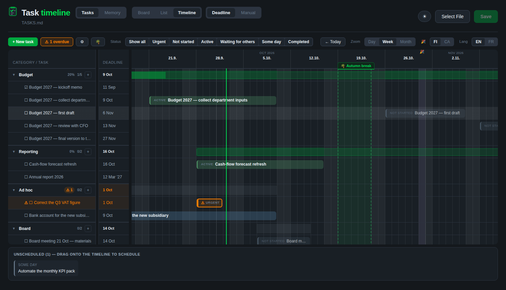
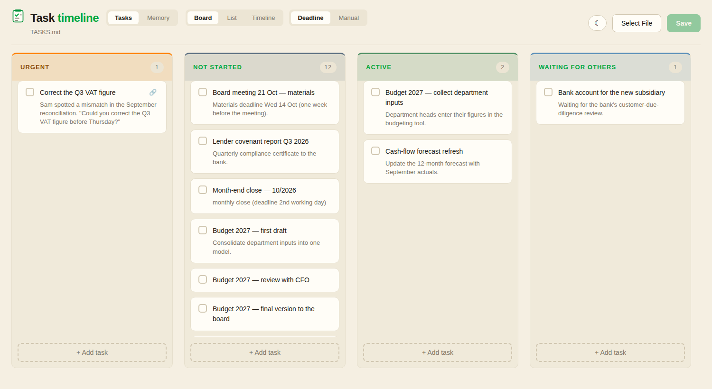

# Task timeline

A task tracker that lives in one markdown file, with a board and timeline dashboard on
top and an AI assistant that keeps it up to date with you.

- **`TASKS.md`** holds every task as one line: title, date range, category, note and source link.
- **`dashboard.html`** shows it as a kanban board, a list, or a timeline. It reads and
  writes the same file, so edits in the dashboard and edits by your assistant stay in sync.
- **Plain-language instructions** (skills) tell your assistant how the list works:
  date rules, recurring tasks, a weekly review and what it may change without asking.

**[▶ Try the live demo](https://akaukora.github.io/task-timeline/)** — fictional example
tasks dated around today, in any browser. Nothing is saved.





## What the timeline does

- Swimlanes by category. A *process* category (a budget cycle, say) gets a roll-up bar
  with % complete; a *bag* category just groups independent tasks.
- Drag a bar to move it, drag its ends to change the dates, drag an unscheduled task
  onto the grid to give it dates.
- Dated sub-items appear as milestone diamonds on their task's bar.
- Day, week and month zoom, with gridlines for days, weeks (Mondays) and month starts.
- Public holidays (Finland, Canada) and your own vacation periods shaded on the grid.
- Deadline column, overdue counter and highlighting, status filters, and row hover that
  lights up the same task across the name, deadline and timeline columns.
- `[↻ monthly|quarterly|annual]` on a task: tick it done and the next one is created.
- Dark and light themes (follows your system; the ☀/☾ button switches and remembers).
- English and French interface.

## Getting started

### With Claude (Cowork or Claude Code)

Install this repository as a plugin, or just download it, then open the folder where
you want to keep your tasks and say:

> Set up the task timeline here.

The `start` skill creates `TASKS.md`, `CLAUDE.md` and a `memory/` folder, copies the
dashboard, and helps you bring in your current to-do list. After that, ask things like
"what's due this week?", "add a task: send the Q3 report to Maria by Friday", or
"run the weekly update".

### With another AI assistant

Any assistant that can read and edit files in a folder can run this. Point it at
[`AGENTS.md`](AGENTS.md) — it explains the files and links to the instructions. Chat
assistants that can't edit your files can still advise you, and you can use the
dashboard on its own.

### Just the dashboard

Copy `skills/dashboard.html` and `template/TASKS.md` into a folder, open the HTML file
in Chrome or Edge, click **Select File** and choose `TASKS.md`. For the Memory tab and
category settings, click **Open Folder** and choose the whole folder.

**Browser:** the dashboard uses the browser's local file access, so it needs **desktop
Chrome or Edge**. Safari, Firefox and phone browsers show a message instead (the demo
works everywhere, because it doesn't touch your files). Keep the folder in OneDrive,
Dropbox or similar if you want the same tasks on several computers.

### The demo page

`index.html` opens the dashboard as `skills/dashboard.html?demo`: it builds a set of
example tasks dated relative to today, shows a "Demo" banner with a link back to this
repository, and saves nothing. On a fork, turn on **Settings → Pages → Deploy from a
branch → main / (root)** and the demo appears at `https://<you>.github.io/<repo>/`; the
banner link points at your repository automatically.

## Files

```
index.html                  the live demo (GitHub Pages entry point)
skills/
  dashboard.html            the dashboard (single file, no install, no network)
  start/SKILL.md            first-time setup
  task-management/SKILL.md  adding, completing, rescheduling, extracting tasks
  memory-management/SKILL.md  people, terms and projects the assistant should know
  update/SKILL.md           the weekly review
template/                   fictional example of a working folder
  TASKS.md                  example tasks showing every feature
  CLAUDE.md                 working memory + the task-list rules
  memory/                   glossary, people, projects, recurring rules, categories…
prompts/weekly-update.md    prompt for a weekly scheduled run
AGENTS.md                   entry point for non-Claude assistants
```

All example people, companies and tasks are fictional.

## The rules, in short

These live in `template/CLAUDE.md`. Keep, change or delete any of them; the
assistant follows whatever your copy says.

- **Task line:** `` - [ ] **Title** - [2026-10-07 → 2026-10-14] `CATEGORY` note ``
- **Date defaults** for tasks from emails: no deadline → 7 days from the message;
  deadline a week or more away → the 7 days before it.
- **Weekend rule:** deadlines never land on a weekend; they move back to Friday.
- **Review first:** the assistant suggests new tasks it finds in email or chat but
  never adds them itself. Dismiss a suggestion for good in `memory/dismissed-suggestions.md`.
- **Weekly update:** shows what changed since last week, archives completed tasks
  older than 90 days, tops up recurring tasks 12 months ahead, and flags overdue and
  long-waiting items.

## Credits and license

Built on the **productivity** plugin from Anthropic's
[knowledge-work-plugins](https://github.com/anthropics/knowledge-work-plugins)
(Apache 2.0). The board, list and memory views come from the original; the timeline,
the recurring-task and source-link features, the weekly-update routine and the theme
were added here. See [NOTICE](NOTICE) for the details.

Colour palette from [akaukora/dashboards](https://github.com/akaukora/dashboards).

Licensed under the Apache License 2.0 — see [LICENSE](LICENSE).
